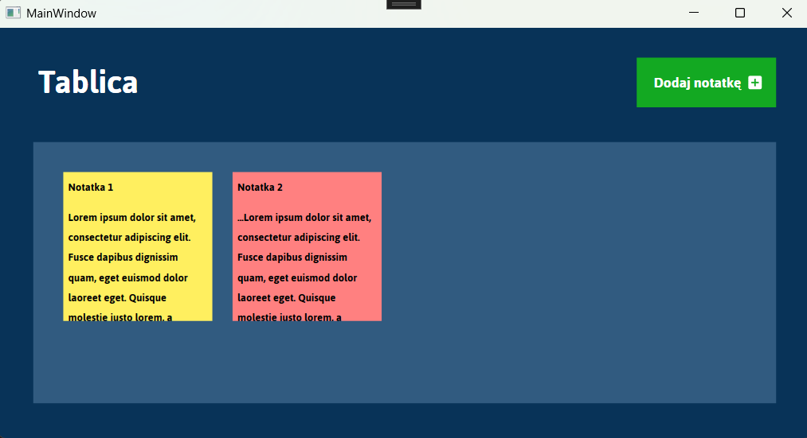
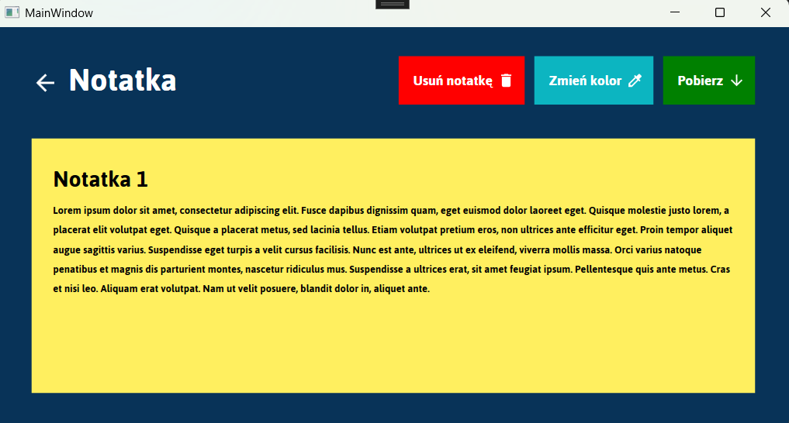

# NoteApp
Aplikacja, w której można dodawać notatki.

## Instrukcja Obsługi 
- Aby dodać notatkę kliknij przycisk na górze ekranu
- Po dodaniu notatki możesz w nią wejść i edytować tytuł oraz treść
- Można także ją pobrać do pliku *txt albo zmienić jej kolor
## Zasada działania
Aplikacja zapisuje notatki wraz z wsystkimi potrzebnymi informacjami w formacie *json w bazie danych MongoDB. Program zawiera klasę "note" na bazie której tworzone są obiekty i listy, co umożliwia łatwą komunikację z bazą danych.  

## Zrzuty ekranu

